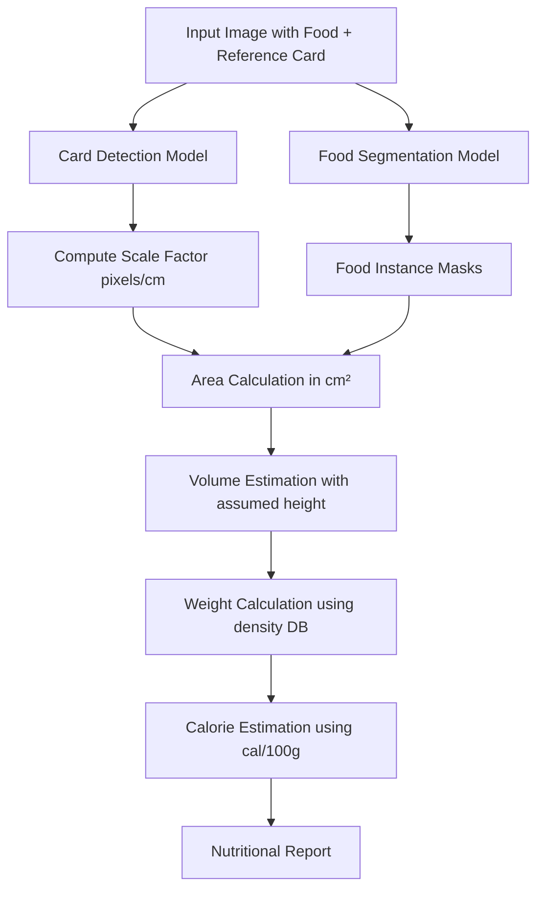

# NutriLens Vision - Project Documentation

## 📋 Overview

This project, **NutriLens Vision**, is an AI-powered food recognition and nutritional estimation system. It uses computer vision and deep learning techniques to:

1. **Detect a reference object** (credit card) in an image to establish a real-world scale (pixels/cm)
2. **Segment food items** in meal images using semantic segmentation
3. **Estimate nutritional content** (weight and calories) based on segmented food areas and a nutritional database

---

## 🗂️ Project Structure

```
f:\AI\CNN\
├── docs/
│   ├── papers.pdf                                           # Research papers (PDF format)
│   └── Project_Architecture_Mermaid.md                      # Architecture diagrams (Mermaid)
├── notebooks/
│   ├── 01_card_detection_and_nutrition_estimation.ipynb     # Card detection & nutrition estimation
│   ├── 02_deeplabv3_mobilenetv2_segmentation_training.ipynb # DeepLabV3+ segmentation model
│   ├── 03_resnet50_fpn_aspp_optimized_segmentation.ipynb    # Optimized ResNet50+FPN+ASPP model
│   └── 04_foodseg103_data_exploration.ipynb                 # FoodSeg103 dataset exploration
├── nutrilens-vision-backend/                                # Backend API (empty - future development)
├── nutrilens-vision-frontend/                               # Frontend app (empty - future development)
└── PROJECT_DOCUMENTATION.md                                 # This documentation file
```

---

## 📈 Project Status

| Component | Status | Notes |
|-----------|--------|-------|
| **Research & Documentation** | ✅ Complete | Papers collected in `docs/` |
| **Data Exploration** | ✅ Complete | FoodSeg103 dataset analyzed |
| **Card Detection Model** | ✅ Complete | ResNet-18 based detector |
| **Segmentation Model v1** | ✅ Complete | DeepLabV3+ with MobileNetV2 |
| **Segmentation Model v2** | ✅ Complete | ResNet50+FPN+ASPP (~29% mIoU) |
| **Nutrition Estimation Pipeline** | ✅ Complete | Volume/calorie calculation |
| **Backend API** | ⏳ Pending | Directory created, awaiting implementation |
| **Frontend Application** | ⏳ Pending | Directory created, awaiting implementation |

---

## 🛠️ Technologies Used

### Core Frameworks & Libraries

| Technology | Version | Purpose |
|------------|---------|---------|
| **Python** | 3.12+ | Primary programming language |
| **PyTorch** | Latest | Deep learning framework |
| **torchvision** | Latest | Pre-trained models and transforms |
| **segmentation_models_pytorch (smp)** | 0.3.3 | Semantic segmentation architectures |
| **timm** | 0.9.2 | PyTorch Image Models for encoders |
| **OpenCV (cv2)** | Latest | Image processing |
| **PIL/Pillow** | Latest | Image loading and manipulation |
| **NumPy** | Latest | Numerical operations |
| **Matplotlib** | Latest | Visualization |
| **tqdm** | Latest | Progress bars |

### Pre-trained Models Used

| Model | Source | Purpose |
|-------|--------|---------|
| **ResNet-18** | torchvision (ImageNet weights) | Card detection backbone |
| **ResNet-50** | torchvision (ImageNet V2 weights) | Optimized segmentation backbone |
| **MobileNetV2** | segmentation_models_pytorch (ImageNet) | Lightweight segmentation backbone |
| **DeepLabV3+** | segmentation_models_pytorch | Segmentation architecture |

### Dataset

- **FoodSeg103**: A semantic segmentation dataset containing 103 food categories
  - Train/Test split structure
  - 104 classes (including background)
  - Standard image sizes: 416x416 or 640x640

---

## 📓 Notebook Descriptions

### 1. `01_card_detection_and_nutrition_estimation.ipynb`
**Purpose**: Reference object detection and nutritional estimation pipeline

#### Key Components:
- **`CardDataset` class**: PyTorch Dataset for loading images and bounding box labels for card detection
- **`CardDetector` class**: Custom CNN using ResNet-18 backbone for bounding box prediction
  - Feature extractor: Pre-trained ResNet-18
  - Head: Linear layers with ReLU and Sigmoid activation (normalized bbox coordinates)
  - Trained for 15 epochs using Adam optimizer (lr=1e-4) and MSE Loss

- **`FOODSEG103_DB`**: Nutritional database mapping food names to:
  - `density` (g/cm³)
  - `cal_per_100g` (calories per 100 grams)

- **Utility Functions**:
  - `mask_area(mask)`: Calculate pixel area of segmentation mask
  - `area_to_cm2(area_px, s)`: Convert pixel area to cm² using scale factor
  - `estimate_weight(area_cm2, density, height_cm=2.5)`: Estimate weight assuming default height
  - `estimate_calories(weight_g, cal_per_100g)`: Calculate caloric content
  - `compute_s_from_image(image_path)`: Detect card and compute pixels/cm scale

#### Workflow:
1. Load image with reference card
2. Detect card bounding box → compute scale factor (pixels/cm)
3. Run food segmentation on image
4. For each food segment:
   - Calculate mask area in pixels
   - Convert to cm² using scale
   - Estimate volume (area × assumed height)
   - Lookup density from database → calculate weight
   - Calculate calories from weight

---

### 2. `02_deeplabv3_mobilenetv2_segmentation_training.ipynb`
**Purpose**: Training a semantic segmentation model for food items

#### Configuration:
```python
SEED = 42                  # Reproducibility
NUM_CLASSES = 104          # FoodSeg103 classes
IGNORE_INDEX = 255         # For CrossEntropyLoss
IMG_SIZE = 416             # Balanced speed/quality
BATCH_SIZE = 8
ACCUM_STEPS = 2            # Gradient accumulation
NUM_EPOCHS = 25
LR = 6e-4                  # Learning rate
WEIGHT_DECAY = 1e-4
```

#### Architecture:
- **Model**: `smp.DeepLabV3Plus`
  - Encoder: `mobilenet_v2` (ImageNet pretrained)
  - Decoder: DeepLabV3+ head
  - Output: 104 classes (logits, no activation)

#### Training Features:
- **Data Augmentation**: Horizontal flip, rotation, color jitter
- **Optimizer**: AdamW with differential learning rates
  - Encoder: LR × 0.25
  - Decoder: LR × 1.0
- **Scheduler**: OneCycleLR for fast convergence
- **Loss**: CrossEntropyLoss (with ignore_index=255)
- **Mixed Precision**: `torch.cuda.amp.GradScaler()` for efficiency
- **Metrics**: Accuracy and Mean IoU (mIoU)

#### Key Classes:
- **`FoodSegDataset`**: Handles image/mask loading with augmentations
- **`fast_metrics()`**: Vectorized accuracy and mIoU calculation

---

### 3. `03_resnet50_fpn_aspp_optimized_segmentation.ipynb`
**Purpose**: Ultimate optimized solution for maximum performance

#### Target: 38-45% mIoU in 50-70 minutes

#### Configuration:
```python
IMG_SIZE = 384-416
BATCH_SIZE = 12-18
GRADIENT_ACCUMULATION = 2
BACKBONE_LR = 1.2e-4
HEAD_LR = 1.2e-3
DROPOUT = 0.15
NUM_EPOCHS = 35
```

#### Custom Architecture (`UltimateDeepLab`):
```
Input → ResNet50 Backbone
           ↓
    Layer1 → Layer2 → Layer3 → Layer4
                  ↓         ↓        ↓
              [512ch]  [1024ch]  [2048ch]
                  ↓         ↓        ↓
              Light FPN (Feature Pyramid Network)
                            ↓
                     Fast ASPP Module
                            ↓
                    Feature Fusion (4×256ch)
                            ↓
                      Efficient Decoder
                            ↓
                        Output (104 classes)
```

#### Key Components:
- **`FastASPP`**: Efficient ASPP with depthwise separable convolutions
  - 1×1 conv, dilated 3×3 (rate 6), dilated 3×3 (rate 12), global pooling
- **`LightFPN`**: Lightweight Feature Pyramid Network for multi-scale features
- **`UltimateDeepLab`**: Main model with deep supervision (auxiliary head)
- **`OptimizedFocalLoss`**: Focal loss with label smoothing

#### Advanced Features:
- Path caching for faster data loading
- Early stopping (patience = 12)
- Checkpoint saving every 5 epochs
- Warm start support for resuming training

#### Results:
- Best validation mIoU: ~29.2% (after 25 epochs with early stopping)
- Model size: ~365 MB

---

### 4. `04_foodseg103_data_exploration.ipynb`
**Purpose**: Data preparation and exploration for FoodSeg103 dataset

#### Contents:
- Dataset structure exploration
- Image path listing and validation
- Preliminary data analysis
- Understanding annotation formats

---

## 📚 Research Papers

The `docs/papers.pdf` file contains research literature that informed this project. Due to PDF format limitations, the specific content cannot be extracted programmatically. The papers likely cover:

- Food recognition and segmentation techniques
- Portion size estimation methods
- Nutritional estimation from images
- Deep learning architectures for food analysis
- Reference object-based scale determination

**Recommended Reading Areas**:
1. Semantic segmentation with CNNs
2. DeepLabV3+ architecture and ASPP modules
3. Feature Pyramid Networks (FPN)
4. Food image analysis and portion estimation
5. Transfer learning with ImageNet pre-trained models

---

## 🔄 Processing Pipeline

For detailed architecture diagrams, please refer to [docs/Project_Architecture_Mermaid.md](docs/Project_Architecture_Mermaid.md).



---

## 📊 Model Comparison

| Model | Backbone | mIoU | Size | Training Time | Use Case |
|-------|----------|------|------|---------------|----------|
| DeepLabV3+ | MobileNetV2 | ~24% | Smaller | ~2.5 hrs | Mobile/embedded |
| UltimateDeepLab | ResNet50+FPN+ASPP | ~29% | 365 MB | ~70 min | Server deployment |

---

## 🎯 Key Insights from the Project

### Design Decisions

1. **Reference Object Approach**: Using a known-size object (credit card, 8.5 cm width) to establish real-world scale, enabling accurate portion size estimation from 2D images.

2. **ResNet-18 for Card Detection**: A lightweight model sufficient for simple bounding box regression on a single object class.

3. **MobileNetV2 vs ResNet50**: 
   - MobileNetV2: Better for edge deployment, lower accuracy
   - ResNet50: Higher accuracy, requires more compute

4. **FPN + ASPP Combination**: Multi-scale feature extraction (FPN) combined with atrous spatial pyramid pooling (ASPP) captures both fine details and global context.

5. **Focal Loss with Label Smoothing**: Addresses class imbalance in segmentation and improves generalization.

6. **Assumed Height (2.5 cm)**: A simplification for volume estimation; could be improved with depth estimation or stereoscopic imaging.

### Limitations

1. Volume estimation assumes uniform height for all foods
2. Nutritional database depends on accurate food classification
3. Occlusion handling not explicitly addressed
4. Single reference object type (credit card)

### Potential Improvements

1. Depth estimation for accurate volume calculation
2. Multi-reference object support
3. Food weight regression directly from images
4. Active learning for expanding the nutritional database
5. Real-time mobile deployment with quantized models

---

## 🚀 Getting Started

### Prerequisites
```bash
pip install torch torchvision
pip install segmentation-models-pytorch==0.3.3
pip install timm==0.9.2
pip install opencv-python pillow numpy matplotlib tqdm
```

### Running the Notebooks
1. Ensure FoodSeg103 dataset is available at the expected path
2. Run notebooks in order (01 → 04) or independently as needed
3. Trained models are saved as `.pth` files for inference

---

## 📁 Output Files

| File | Description |
|------|-------------|
| `best_deeplabv3plus_mobilenetv2.pth` | Best DeepLabV3+ model checkpoint |
| `best_ultimate_model.pth` | Best optimized segmentation model |
| `checkpoint_epoch_*.pth` | Periodic training checkpoints |
| `FoodSeg_Model_*.pth` | Final model for deployment |

---

## 📝 Notes

- **GradScaler Deprecation**: The notebooks use the deprecated `torch.cuda.amp.GradScaler()`. For PyTorch 2.0+, use `torch.amp.GradScaler('cuda')`.
- **Class Names**: The `FOODSEG103_CLASS_MAP` is referenced but defined externally; ensure the class mapping is loaded before inference visualization.
- **Dataset Paths**: Update `ROOT_DIR` paths as needed for your local setup.