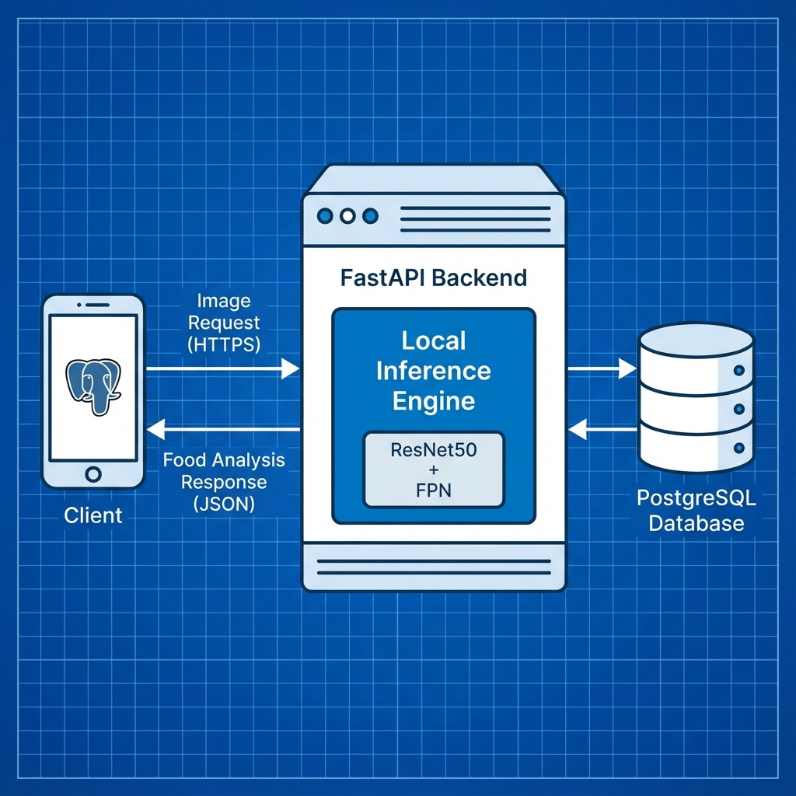
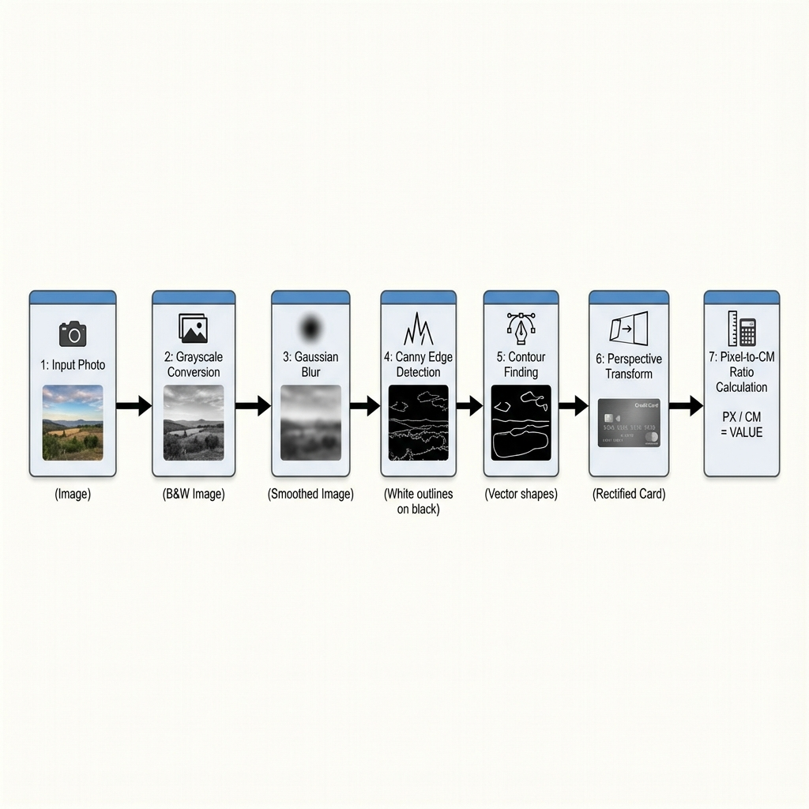
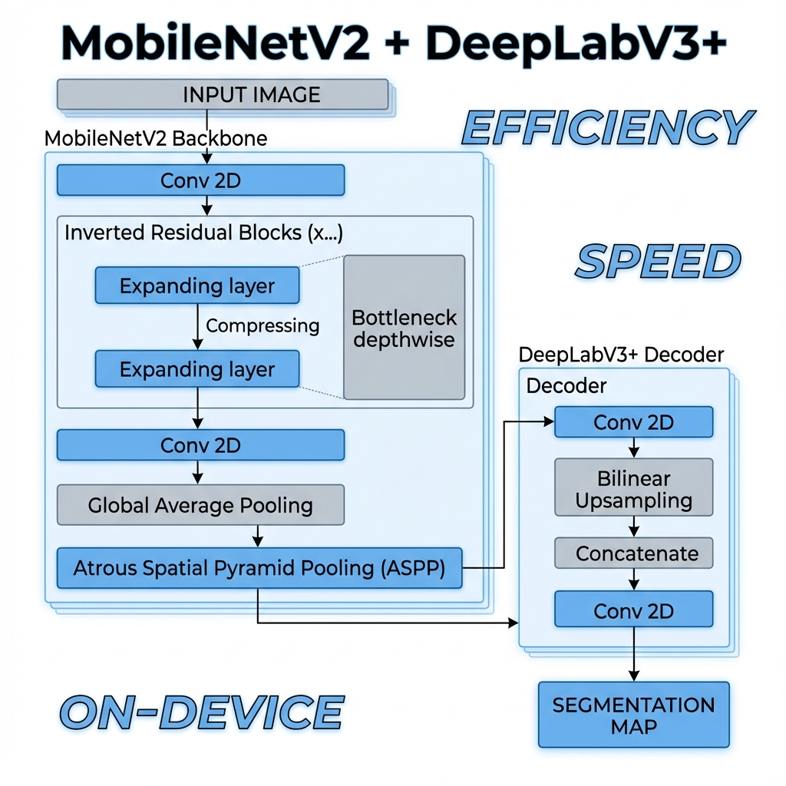
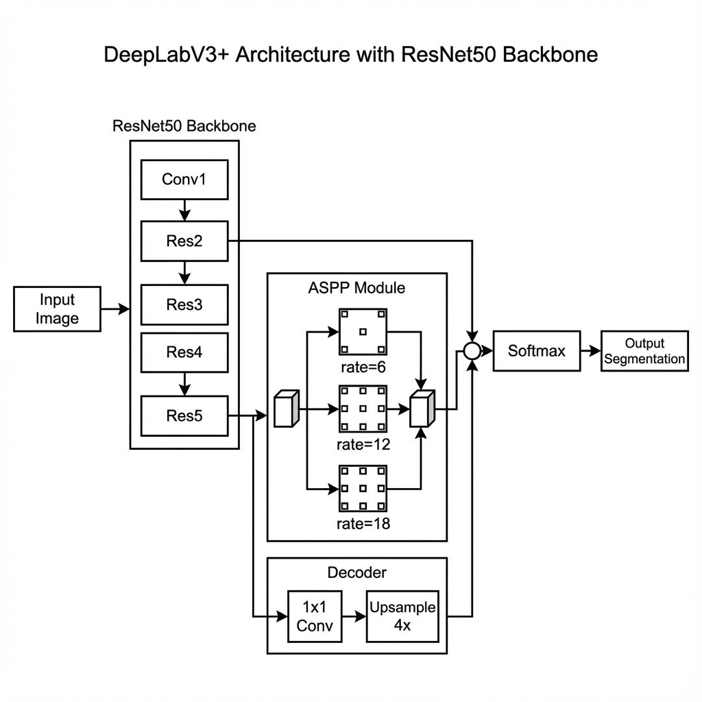
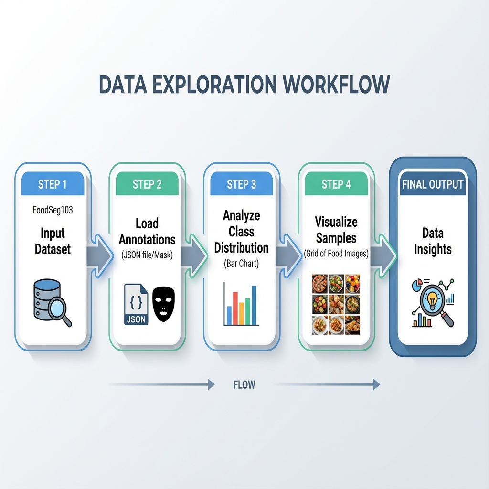
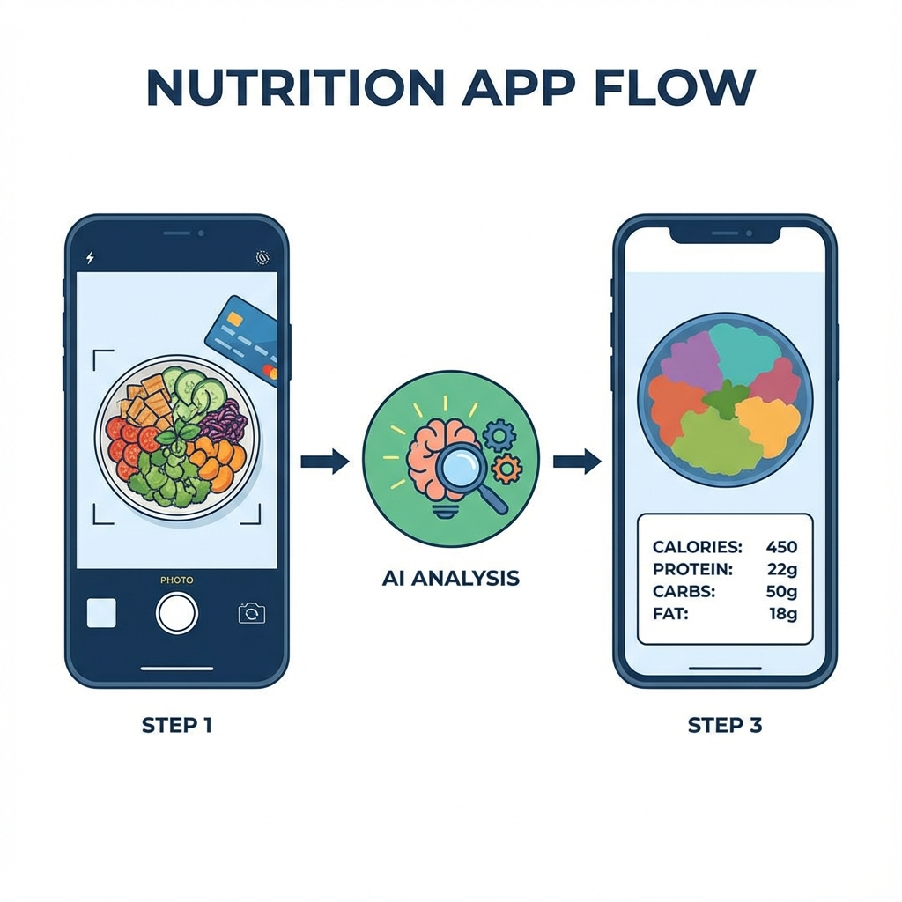

# NutriLens Vision - Project Documentation

## 📋 Overview

This project, **NutriLens Vision**, is an AI-powered food recognition and nutritional estimation system. It uses computer vision and deep learning techniques to:

1. **Detect a reference object** (credit card) in an image to establish a real-world scale (pixels/cm)
2. **Segment food items** in meal images using semantic segmentation
3. **Estimate nutritional content** (weight and calories) based on segmented food areas and a nutritional database



---

## 🗂️ Project Structure

```
f:\AI\CNN\
├── docs/
│   ├── papers.pdf                                           # Research papers (PDF format)
│   └── Project_Architecture_Mermaid.md                      # Architecture diagrams (Mermaid)
├── notebooks/
│   ├── 01_card_detection_and_nutrition_estimation.ipynb     # Card detection & nutrition estimation
│   ├── 02_deeplabv3_mobilenetv2_segmentation_training.ipynb # DeepLabV3+ segmentation model
│   ├── 03_resnet50_fpn_aspp_optimized_segmentation.ipynb    # Optimized ResNet50+FPN+ASPP model
│   └── 04_foodseg103_data_exploration.ipynb                 # FoodSeg103 dataset exploration
├── nutrilens-vision-backend/                                # Backend API (FastAPI + Supabase)
├── nutrilens-vision-frontend/                                # Frontend application (React + Vite)
└── PROJECT_DOCUMENTATION.md                                 # This documentation file
```

---

## 📈 Project Status

| Component | Status | Notes |
|-----------|--------|-------|
| **Research & Documentation** | ✅ Complete | Papers collected in `docs/` |
| **Data Exploration** | ✅ Complete | FoodSeg103 dataset analyzed |
| **Card Detection Model** | ✅ Complete | ResNet-18 based detector |
| **Segmentation Model v1** | ✅ Complete | DeepLabV3+ with MobileNetV2 |
| **Segmentation Model v2** | ✅ Complete | ResNet50+FPN+ASPP (~29% mIoU) |
| **Nutrition Estimation Pipeline** | ✅ Complete | Volume/calorie calculation |
| **Backend API** | 🚧 In Progress | FastAPI serving models & logic |
| **Frontend Application** | 🚧 In Progress | React UI for capture & dashboard |

---

## 🛠️ Technologies Used

### Core Frameworks & Libraries

| Technology | Version | Purpose |
|------------|---------|---------|
| **Python** | 3.12+ | Primary programming language |
| **PyTorch** | Latest | Deep learning framework |
| **FastAPI** | Latest | Backend API framework |
| **React / Vite** | Latest | Frontend framework and build tool |
| **segmentation_models_pytorch** | 0.3.3 | Semantic segmentation architectures |
| **timm** | 0.9.2 | PyTorch Image Models for encoders |
| **OpenCV (cv2)** | Latest | Image processing |

### Pre-trained Models Used

| Model | Source | Purpose |
|-------|--------|---------|
| **ResNet-18** | torchvision | Card detection backbone |
| **ResNet-50** | torchvision | Optimized segmentation backbone |
| **MobileNetV2** | segmentation_models_pytorch | Lightweight segmentation backbone |
| **DeepLabV3+** | segmentation_models_pytorch | Segmentation architecture |

---

## 📓 Notebook Descriptions

### 1. `01_card_detection_and_nutrition_estimation.ipynb`
**Purpose**: Reference object detection and nutritional estimation pipeline



#### Key Components:
- **`CardDetector` class**: Custom CNN using ResNet-18 backbone for bounding box prediction
- **`FOODSEG103_DB`**: Nutritional database mapping food names to density and calories
- **Utility Functions**: Area calculation, weight estimation, and calorie computation.

#### Workflow:
1. Load image with reference card
2. Detect card bounding box → compute scale factor (pixels/cm)
3. Run food segmentation on image
4. Estimate volume, weight, and calories

---

### 2. `02_deeplabv3_mobilenetv2_segmentation_training.ipynb`
**Purpose**: Training a semantic segmentation model for food items (MobileNetV2 Backbone)



#### Configuration:
- **Model**: `smp.DeepLabV3Plus` with `mobilenet_v2` encoder
- **Loss**: CrossEntropyLoss
- **Optimizer**: AdamW

---

### 3. `03_resnet50_fpn_aspp_optimized_segmentation.ipynb`
**Purpose**: Ultimate optimized solution for maximum performance



#### target: 38-45% mIoU in 50-70 minutes

#### Custom Architecture (`UltimateDeepLab`):
- **Backbone**: ResNet50
- **Neck**: Light FPN (Feature Pyramid Network)
- **Head**: Fast ASPP + Efficient Decoder

---

### 4. `04_foodseg103_data_exploration.ipynb`
**Purpose**: Data preparation and exploration for FoodSeg103 dataset



---

## 🔄 User Journey Flow



---

## 📚 Research Papers

The `docs/papers.pdf` file contains research literature that informed this project.

**Recommended Reading Areas**:
1. Semantic segmentation with CNNs
2. DeepLabV3+ architecture and ASPP modules
3. Feature Pyramid Networks (FPN)
4. Food image analysis and portion estimation

---

## 🚀 Getting Started

### Prerequisites
```bash
pip install torch torchvision
pip install segmentation-models-pytorch==0.3.3
pip install timm==0.9.2
pip install opencv-python pillow numpy matplotlib tqdm
```

### Running the Notebooks
1. Ensure FoodSeg103 dataset is available at the expected path
2. Run notebooks in order (01 → 04) or independently as needed
3. Trained models are saved as `.pth` files for inference

---

## 📁 Output Files

| File | Description |
|------|-------------|
| `best_deeplabv3plus_mobilenetv2.pth` | Best DeepLabV3+ model checkpoint |
| `best_ultimate_model.pth` | Best optimized segmentation model |
| `checkpoint_epoch_*.pth` | Periodic training checkpoints |
| `FoodSeg_Model_*.pth` | Final model for deployment |