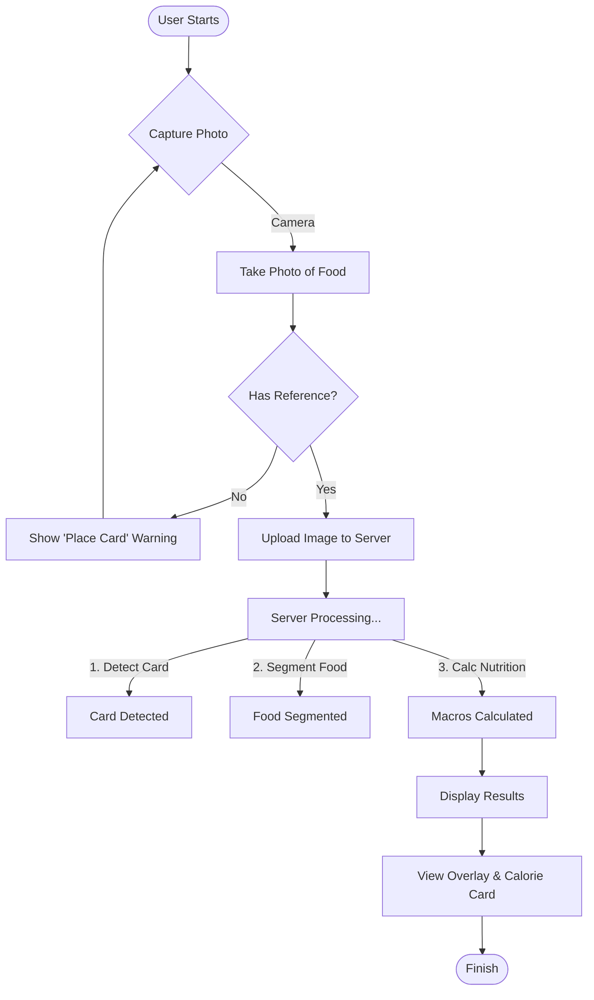

# Project Architecture & Flows (Mermaid)

This document contains all project diagrams in Mermaid format for easy editing and version control.

## 1. High-Level System Architecture
The overall interaction between the Frontend Client, Backend API, and the Local Inference Engine.

```mermaid
graph LR
    subgraph Client [Frontend (React/Vite)]
        UI[User Interface]
        Canvas[Canvas Resizer]
        State[React Query State]
    end

    subgraph Server [Backend (FastAPI)]
        API[API Endpoints]
        Val[Pydantic Validation]
        subgraph Engine [Inference Engine]
            Pre[Pre-processor]
            Model[ResNet50+ASPP Model]
            Post[Post-processor]
        end
    end

    subgraph Data [Storage]
        DB[(Nutrition DB)]
    end

    UI -->|Capture Image| Canvas
    Canvas -->|Upload w/ Ref Object| API
    API -->|Validate| Val
    Val -->|Tensor Input| Pre
    Pre -->|Inference| Model
    Model -->|Seg Mask| Post
    Post -->|Map to Macros| DB
    DB -->|Nutrition JSON| API
    API -->|Response| State
    State -->|Render Overlay| UI
```

## 2. User Journey Flow
The step-by-step experience of a user interacting with the application.



## 3. Deep Learning Model Architecture
The internal structure of the `FoodSeg103` trained model (ResNet50 + DeepLabV3+).

```mermaid
graph TD
    Input[Input Image (512x512)] --> ResNet
    
    subgraph ResNet [ResNet50 Backbone]
        C1[Conv1] --> C2[Res2 Block]
        C2 --> C3[Res3 Block]
        C3 --> C4[Res4 Block]
        C4 --> C5[Res5 Block]
    end

    subgraph DeepLab [DeepLabV3+ Head]
        ASPP[ASPP Module]
        subgraph ASPP_Rates [Dilated Convs]
            R1[Rate=6]
            R2[Rate=12]
            R3[Rate=18]
            GP[Global Pooling]
        end
        Dec[Decoder]
    end

    C5 --> ASPP
    ASPP --> R1 & R2 & R3 & GP
    R1 & R2 & R3 & GP -->|Concat| Proj[Projection]
    
    C2 -->|Low-Level Feats| Dec
    Proj -->|High-Level Feats| Dec
    
    Dec -->|Upsample 4x| Output[Segmentation Mask]
```

## 4. Reference Object Detection Pipeline
The Computer Vision logic to determine `pixels_per_cm` using a credit card.

```mermaid
flowchart LR
    Img[Raw Image] -->|Grayscale| Gray[Grayscale]
    Gray -->|Gaussian Blur| Blur[Blurred Image]
    Blur -->|Canny| Edges[Edge Map]
    Edges -->|Find Contours| Contours[Vector Contours]
    Contours -->|Approx PolyDP| Poly[Polygons]
    Poly -->|Filter 4-Corner| Quad[Quadrilateral]
    Quad -->|Perspective Warp| Rect[Rectified Card]
    Rect -->|Measure Width| Pixels[Pixel Width]
    Pixels -->|Divide by 8.56cm| Ratio[px/cm Ratio]
```


